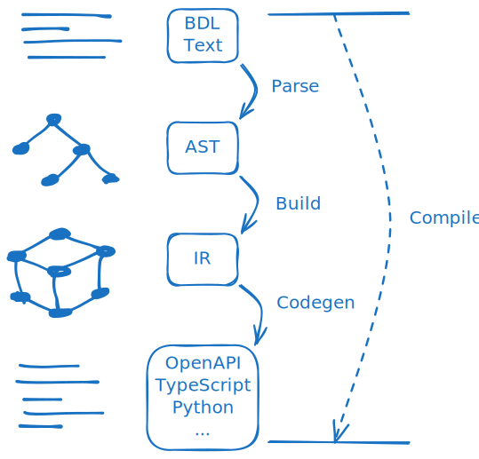

# Intermediate Representation (IR)



The process of compiling BDL texts into the target language can be divided into three main steps.

The first step is called Parse, where the text is converted into an abstract syntax tree (AST).\
This step is well explained in the [BDL Syntax](./syntax.md) document
using [railroad diagram](https://en.wikipedia.org/wiki/Syntax_diagram)s, so please refer to that.

The second step is called Build.
In this step, references within the AST are resolved to their actual targets and represented in a graph-like structure.

In the diagram, this step is depicted linearly, but in reality, the IR is constructed by taking multiple ASTs as input.
Therefore, when a single IR is given, it can be seen as containing all the context needed to process BDL.

Finally, through the Codegen step, text is generated in the target language.\
While BDL encourages users to develop this part themselves, if that feels overwhelming, you can use the official tooling that follows [the `conventional` standard](./standard.md#the-conventional-standard).

## `BdlIr`

This struct corresponds to the root of the BDL IR.\
It contains all the type definitions needed for code generation.

```bdl
struct BdlIr {
  modules: Module[string],
  defs: Def[string],
}
```

As seen in the definition above, it contains the `modules` and `defs` fields.

The `modules` field is a flattened table of all BDL files, using their absolute paths as keys.
It shows how the modules import one another and what type definitions are contained within each module.

The `defs` field is also a flattened table of all type definitions across BDL files, keyed by their absolute paths.

### Type Path

```
package name            pkg
 |  module directory    <pkg dir>/foo/bar
 |   |      def name    Baz
 |   |       |
vvv vvvvvvv vvv
pkg.foo.bar.Baz
^^^^^^^^^^^     <- module path  pkg.foo.bar
^^^^^^^^^^^^^^^ <- def path     pkg.foo.bar.Baz
```

The absolute path keys used in the `modules` and `defs` tables follow the type path format.

A type path consists of [identifier](./syntax.md#identifier)s connected by dots (`.`),
and when it refers to a module, it's called a module path;
when it refers to a definition, it's also referred to as a def path.

Since every def belongs to some module, a module path always precedes it's path.
BDL intentionally does not support nested type definitions, so every def path takes the form of a module path followed by the def name, connected by a dot.

> [!NOTE]
> In the context of type paths, if an identifier is used without any dots,
> it is considered the name of a primitive type.

## `Module`

```bdl
struct Module {
  fileUrl?: string,
  attributes: string[string],
  defPaths: string[],
  imports: Import[],
}
```

## `Import`

```bdl
struct Import {
  attributes: string[string],
  modulePath: string,
  items: ImportItem[],
}
```

## `ImportItem`

```bdl
struct ImportItem {
  name: string,
  as?: string,
}
```

## `Def`

```bdl
union Def {
  Custom(
    attributes: string[string],
    name: string,
    originalType: Type,
  ),
  Enum(
    attributes: string[string],
    name: string,
    items: EnumItem[],
  ),
  Oneof(
    attributes: string[string],
    name: string,
    items: OneofItem[],
  ),
  Proc(
    attributes: string[string],
    name: string,
    inputType: Type,
    outputType: Type,
    errorType?: Type,
  ),
  Struct(
    attributes: string[string],
    name: string,
    fields: StructField[],
  ),
  Union(
    attributes: string[string],
    name: string,
    items: UnionItem[],
  ),
}
```

### `Custom`

### `Enum`

### `Oneof`

### `Proc`

### `Struct`

### `Union`

## `EnumItem`

```bdl
struct EnumItem {
  attributes: string[string],
  name: string,
}
```

## `OneofItem`

```bdl
struct OneofItem {
  attributes: string[string],
  itemType: Type,
}
```

## `StructField`

```bdl
struct StructField {
  attributes: string[string],
  name: string,
  fieldType: Type,
  optional: boolean,
}
```

## `Type`

```bdl
union Type {
  Plain(valueTypePath: string),
  Array(valueTypePath: string),
  Dictionary(valueTypePath: string, keyTypePath: string),
}
```

### `Plain`

### `Array`

### `Dictionary`

## `UnionItem`

```bdl
struct UnionItem {
  attributes: string[string],
  name: string,
  fields: StructField[],
}
```
